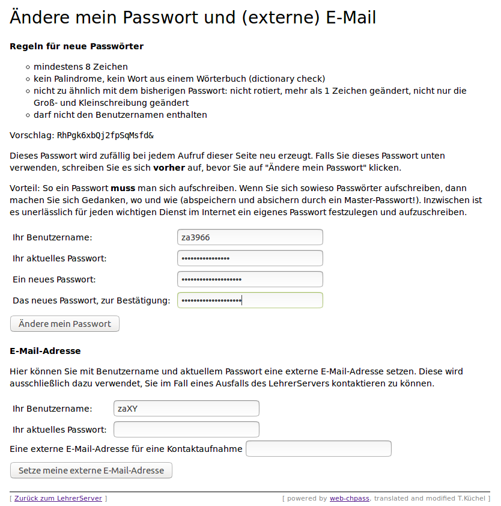
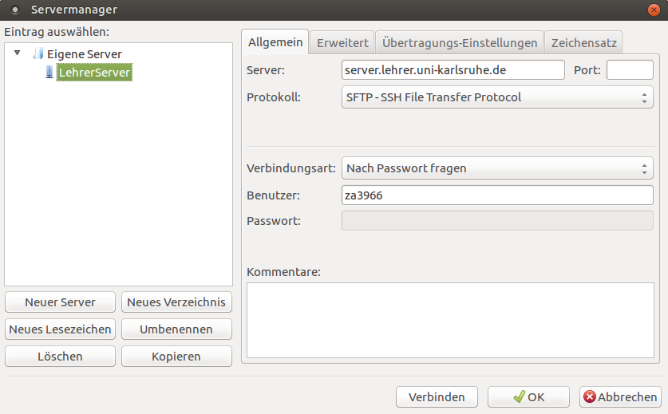
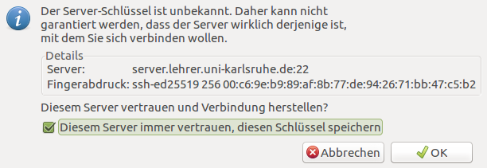
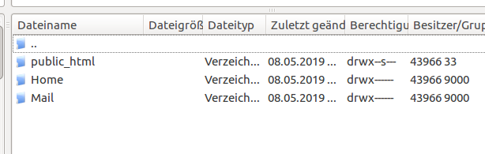

=============================================
 Nutzung des Kontos: Login und Dateitransfer
=============================================

Möchten Sie Ihr Konto löschen lassen? Kontaktieren Sie
tobias.kuechel@lehrer.uni-karlsruhe.de.

Passwort ändern
===============

Wer sein Passwort noch kennt, kann es hier ändern:

https://www.lehrer.uni-karlsruhe.de/admin/chpass.pl

Die folgende Abbildung zeigt ein Beispiel für das Ändern des eigenen
Passwortes.

Externe E-Mail-Adresse angeben.
===============================

Wie auf der gezeigten Seite dargestellt, kann man hier auch eine
externe E-Mail-Adresse angeben, die ausschließlich dafür benutzt wird,
Sie in dringenden Fällen zu kontaktieren und zu informieren.

Dateitransfer
=============
	    
Der Dateitransfer funktioniert über SFTP. Dafür kann man verschiedene
Programme verwenden. Ein Standardprogramm ist "Filezilla", welches man
hier https://filezilla-project.org/ herunterladen kann.

Der folgende Dialog kann über das Menü "Datei" - "Servermanager"
erreicht werden. Fügen Sie einen Server hinzu und konfigurieren Sie
ihn so:

Bei der allerersten Verbindung mit dem LehrerServer wird der
Fingerabdruck des öffentlichen Schlüssels angezeigt, den man hier
vergleichen sollte:

Im weiteren Verlauf sieht man nun, dass die Lehrerseite in drei
Verzeichnisse aufgeteilt ist, Home, Mail und public_html.

public_html
  Hier liegen die Homepage-Daten

Mail
  Das ist der Ablageort für alle E-Mails auf dem Server

Home
  Das ist ein Ablageort für alle anderen Sachen.   

  

.. 
  Folgende Anleitungen finden Sie hier:
  
  .. toctree::
     :maxdepth: 2
  
  
  
     installation
     login
     passwortaendern
     dosanddonts
     filetransfer

