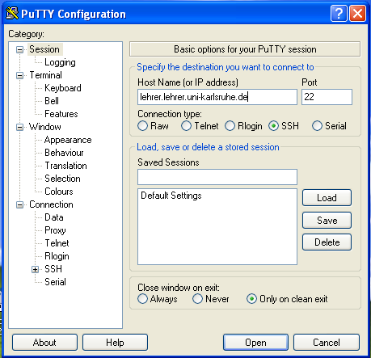
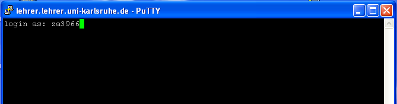

Anmelden am Lehrer-Server
=========================

Vorab: Fingerabdrücke des Lehrer-Servers
----------------------------------------

Sie erhalten bei der ersten Sitzung die Rückmeldung, dass Sie den
Rechner ``lehrer.lehrer.uni-karlsruhe.de`` zum ersten Mal besuchen und
werden gefragt, ob Sie dessen Identifikation mit einem bestimmten
Fingerabdruck in Zukunft immer vertrauen wollen.

Die Fingerabdrücke des Lehrer-Servers sind

.. code:: console

   MD5:
   1024 e9:fa:cb:1f:5c:75:9f:fc:a4:c7:b4:d9:11:29:b3:6e (DSA)
   256  bd:fd:40:54:c1:4c:76:ae:d3:e1:19:b5:13:72:24:40 (ECDSA)
   256  cd:ae:1b:18:87:e6:d4:dc:c1:f2:6c:5e:d5:79:e9:25 (ED25519)
   2048 da:c7:c4:c9:30:39:fb:19:08:4f:81:71:7e:d7:ae:98 (RSA)

   SHA256:
   1024 xCaUPK/kVBsnV/qJ0riPBaIllQcSq2LIiVEqhL7acMA (DSA)
   256  oyFE3aI9/KPj37dih9ErDir0sT0HmF2TbJqNq72kGbk (ECDSA)
   256  W2PTQkaHdAwoOIVT6Si3SCxBoWhWZrQdyJiDHqSNyUE (ED25519)
   2048 VTHrv1EaV5MWlKlJUNjV89R9waDJ2bTJk7uselegTlY (RSA)
   
Wird einer der angezeigten Fingerabdrücke zurückgemeldet, können Sie
sicher sein, sich tatsächlich mit dem Lehrer-Server zu verbinden.

Unter Windows verbinden
-----------------------

Öffnen Sie putty

   
Geben Sie im Feld *Host Name (or IP address)* den Hostnamen des
Lehrer-Servers ein, wie im Bild angezeigt:
``lehrer.lehrer.uni-karlsruhe.de``. Die Verbindung muss per SSH auf
Port 22 erfolgen und ist standardmäßig so eingestellt. Klicken Sie auf
*Open*.

Verifizieren Sie bei der ersten Sitzung, ob der Lehrer-Server eines
der obig genannten Fingerabdrücke besitzt und bestätigen Sie mit "Ja".

.. figure:: media/putty-keyverification.png

Geben Sie jetzt im Terminal-Fenster Ihren Benutzernamen ein ``za....``.
	    

Es wird dann das Passwort abgefragt. 

.. attention:: 

   Beachten Sie: Die Eingabe des Passworts wird Ihnen nicht
   zurückgemeldet. Sie sehen keine "*" oder das Passwort selbst,
   während Sie es eingeben.

.. figure:: media/putty-login.png

Im Beispiel wurde das Passwort zunächst falsch eingegeben, dann
korrekt. Sie sind nun drin, wenn das Prompt

.. code:: console

   za....@lehrer:~$

erscheint.

Unter Linux/Mac OS
------------------

Öffnen Sie ein Terminal, verbinden Sie sich mit dem Lehrerserver mit
folgendem Befehl ``ssh lehrer.lehrer.uni-karlsruhe.de -l za3966``,
ersetzen Sie dabei ``za3966`` durch den Benutzernamen Ihres Kontos.

.. code-block:: console

   ~$ ssh lehrer.lehrer.uni-karlsruhe.de -l za3966
   The authenticity of host 'lehrer.lehrer.uni-karlsruhe.de (129.13.250.22)' can't be established.
   ECDSA key fingerprint is SHA256:oyFE3aI9/KPj37dih9ErDir0sT0HmF2TbJqNq72kGbk.
   Are you sure you want to continue connecting (yes/no)? yes
   Warning: Permanently added 'lehrer.lehrer.uni-karlsruhe.de' (ECDSA) to the list of known hosts.

Bei erstmaliger Anmeldung müssen Sie hier mit ``yes`` antworten. Es wird dann das Passwort abgefragt.

.. attention:: 

   Beachten Sie: Die Eingabe des Passworts wird Ihnen nicht
   zurückgemeldet. Sie sehen keine "*" oder das Passwort selbst,
   während Sie es eingeben.

.. code-block:: console

   za3966@lehrer.lehrer.uni-karlsruhe.de's password:
   Welcome to Ubuntu 16.04.1 LTS (GNU/Linux 4.4.0-59-generic x86_64)
   
    * Documentation:  https://help.ubuntu.com
    * Management:     https://landscape.canonical.com
    * Support:        https://ubuntu.com/advantage
      
   0 Software-Pakete können aktualisiert werden.
   0 Aktualisierungen sind Sicherheitsaktualisierungen.
   
   
   You have mail.
   Last login: Sun Jan 22 21:01:20 2017 from 95.114.99.20
   za3966@lehrer:~$
		    
Sie sind nun drin, wenn das Prompt

.. code:: console

   za....@lehrer:~$

erscheint.
