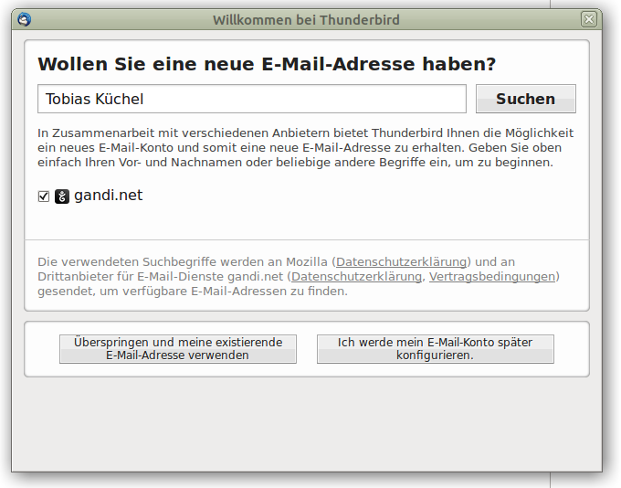
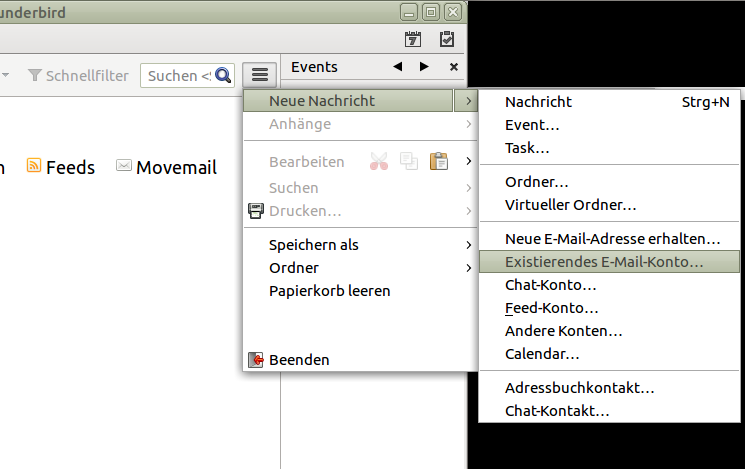

===========================
 Nutzung des E-Mail-Kontos
===========================

Seit dem 1.Mai 2019 funktioniert der E-Mail-Zugang nur noch über
externe Protokolle, das bedeutet, dass Sie ein E-Mail-Programm
(E-Mail-Client) auf einem eigenen Gerät installieren müssen. Diese
Programm verbindet sich dann mit dem Lehrer-Server und lädt E-Mails
herunter und sendet darüber auch E-Mails.

Im Weiteren wird dokumentiert, wie Sie mit Hilfe des Programms
Thunderbird an Ihre E-Mail-Konto kommen. Das gleiche sollte auch mit
jedem anderen modernen (auch mobilen) Mail-Client funktionieren. Bei
Thunderbird ist angenehm, dass er die richtigen Einstellungen
automatisch findet.

Für die Experten, die richtigen Einstellungen sind:

Empfang:
  mail.lehrer.uni-karlsruhe.de, Port 993 (imaps), SSL/TLS (nicht StartTLS!), Benutzername: zaXXX, Passwort (unverschlüsselt, PLAIN)

Versand:
  smtp.lehrer.uni-karlsruhe.de, Port 465 (smtps+AUTH), SSL/TLS (nicht StartTLS!), Benutzername: zaXXX, Passwort (unverschlüsselt, PLAIN)

Thunderbird verwenden
=====================

Thunderbird installieren
------------------------

- Laden Sie den neuesten Thunderbird für Ihr Betriebssystem herunter:
  https://www.thunderbird.net/de/ . Linuxbenutzer sollten
  selbstverständlich den thunderbird Ihrer Distribution installieren
  und verwenden.
- Installieren Sie Thunderbird und starten Sie das Programm zum ersten
  Mal.

Falls beim ersten Starten das Dialogfenster "Willkommen" erscheint,
wählen Sie "Überspringen und meine existierende E-Mail-Adresse
verwenden".

Ansonsten wählen Sie im Menü unter *Datei* -> *Neu* bzw. unter *Neue
Nachricht* unter dem Untermenü -> *Existierendes E-Mail-Konto...*

Mailkonto einrichten
--------------------

Anschließend wird ein neues Konto eingerichtet, dabei geben Sie Name,
E-Mail-Adresse und Passwort ein. Ersetzen Sie dabei ``za3966`` durch
Ihr eigenes Benutzerkonto. Wenn Sie das Passwort speichern, sollten
Sie als Sicherheitsmaßnahme wenigstens `in Thunderbird ein
Master-Passwort vergeben
<https://support.mozilla.org/de/kb/master-passwort>`_, damit das
Passwort nicht im Klartext auf Ihrer Festplatte gespeichert wird.

.. figure:: media/thunderbird-newaccount-1.png

.. attention::

   Füllen Sie die Felder sorgfältig aus. Das Feld "E-Mail-Adresse"
   **muss** in der Form ``zaXXX@lehrer.uni-karlsruhe.de`` eingegeben
   werden.

Nach wenigen Sekunden hat das Programm die richtigen Einstellungen
gefunden und schlägt Server und Ports für den Empfang und das Senden
von E-Mails vor. Diese Einstellungen sollten mit "Fertig" quittiert
werden.

.. figure:: media/thunderbird-autoconfig.png

Ab jetzt können Sie Ihre E-Mails über IMAP/Port 993 (zwangsläufig über
SSL verschlüsselt) lesen. Das Senden von E-Mails über SMTP/Port 465
wird zwangsläufig verschlüsselt und E-Mails werden nur angenommen,
wenn per Benutzername+Passwort authentifiziert wurde.

.. hint::

   Im Gegensatz zu früher kann man nun E-Mails auch ohne Tunnel
   versenden. 

Korrekte Konfiguration
----------------------
   
Wer sein System bereits konfiguriert hat, kann hier nachschauen, ob
die richtigen Einstellungen vorhanden sind. Im Menü "Bearbeiten"
finden Sie den Punkt "Konten-Einstellungen", dort findet man dann
folgende Empfangseinstellungen

Wählt man statt "Server-Einstellungen" den Kontonamen aus, dann findet
sich auch die momentan zugewiesene Versand/SMTP Einstellung.

.. figure:: media/thunderbird-smtp-check.png

Wenn etwas mit dem Versand nicht funktioniert, dann hier auf
"Postausgangs-Server (SMTP) bearbeiten" klicken und man bearbeitet
gleich die ausgewählte SMTP-Serverkonfiguration.

.. figure:: media/thunderbird-smtp-edit.png

Unter Android einrichten
========================

.. 
  Folgende Anleitungen finden Sie hier:
  
  .. toctree::
     :maxdepth: 2 
  
     webmail
     information
     thunderbird
     thunderbird-send

