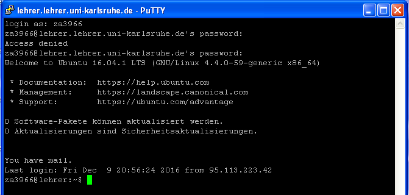
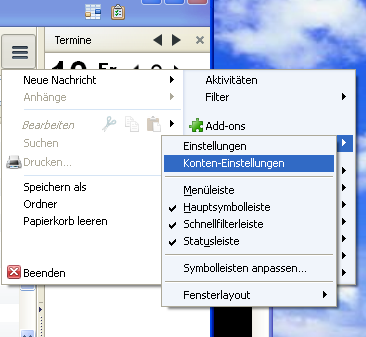
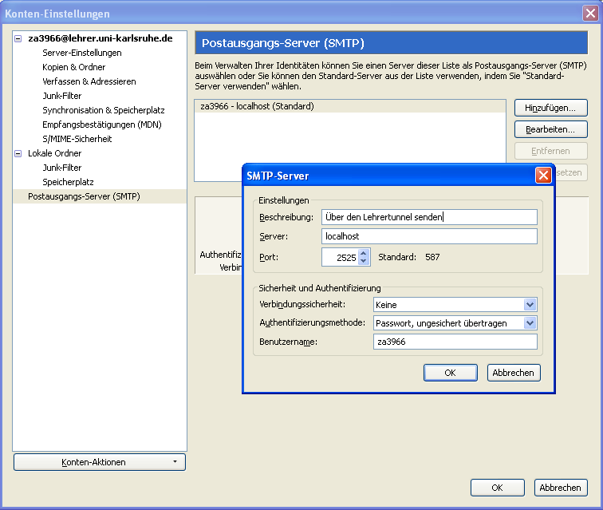
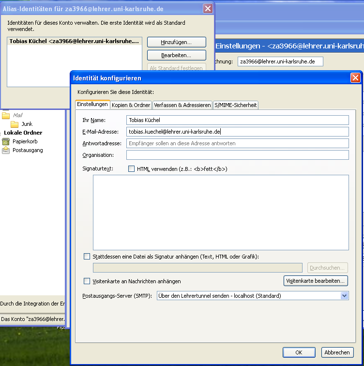

==============================================
 Sende E-Mails mit Thunderbird und SSH-Tunnel
==============================================

Sie haben bereits ein Konto in Thunderbird eingerichtet, das per
POP/IMAP die E-Mails empfängt? Dann werden hier die nötigen Schritte
gezeigt, um auch das Senden von E-Mails über Thunderbird einzurichten.

Äquivalent funktioniert das natürlich auch über andere
E-Mail-Programme.

Installieren Sie zunächst ein SSH-Client-Programm, wie es :ref:`hier
<benutzerkonto-installation-label>` beschrieben wird.

SSH-Tunnel unter MAC und Linux
==============================

Öffnen Sie ein Terminal und verbinden Sie sich mit dem Lehrer-Server
mit Hilfe des folgenden Befehls. Beachten Sie die zusätzliche Option
``-L 25:localhost:2525`` die den Port 25 ihres Rechners auf den Port
2525 des Zielrechners (localhost ist dann der Lehrer-Server) tunnelt.

.. code-block:: console

   ~$ ssh lehrer.lehrer.uni-karlsruhe.de -l za3966 -L 2525:localhost:25
   Welcome to Ubuntu 16.04.2 LTS (GNU/Linux 4.4.0-62-generic x86_64)

    * Documentation:  https://help.ubuntu.com
    * Management:     https://landscape.canonical.com
    * Support:        https://ubuntu.com/advantage

   0 Software-Pakete können aktualisiert werden.
   0 Aktualisierungen sind Sicherheitsaktualisierungen.

   You have mail.
   Last login: Sun Jan 22 22:29:48 2017 from 95.114.99.20
   za3966@lehrer:~$

Sie sind nun angemeldet.

.. note::

   Der Tunnel besteht solange Sie angemeldet sind, auch wenn man
   diesen durch keinen weiteren Hinweis sehen kann.

SSH-Tunnel unter Windows
========================

  #. Öffnen Sie putty, geben folgende Daten ein und speichern danach die "Session":

     .. figure:: ../benutzerkonto/media/putty-start.png

     Host Name:
       ``lehrer.lehrer.uni-karlsruhe.de``

     Connection Type:
       SSH

     Der Port wird dadurch automatisch auf ``22`` gestellt.

     Saved Sessions:
       ``smtptunnel`` oder einen beliebigen anderen Namen, z.B. ``lehrertunnel``

  #. Klicken Sie danach auf "Save".

  #. Öffnen Sie nun in der linken Leiste die Auswahl "Connection" -> "SSH"
     -> "Tunnels" und geben diese Daten ein

     Source port:
       2525
     Destination:
       localhost:25

     .. figure:: media/putty-tunnel-localhost.png

  #. Klicken Sie danach auf die Schaltfläche "Add", um eine Zeile
     ``L2525   localhost:25`` in der Liste "Forwarded ports" in putty zu sehen.

  #. Gehen Sie zurück in der linken Leiste auf "Session", klicken
     wieder auf Ihren Sessionnamen, z.B. "smtptunnel" und klicken
     nochmals auf "Save". Jetzt ist die Tunnelkonfiguration gespeichert.

  #. Öffnen Sie die Verbindung, in dem Sie auf "Open" klicken und Sie
     sich mit Ihrem Benutzernamen und Passwort anmelden. 

.. note::

   Der Tunnel besteht solange Sie angemeldet sind, auch wenn man
   diesen durch keinen weiteren Hinweis sehen kann. Lassen Sie also
   dieses Fenster geöffnet.

Thunderbird zum Versenden einrichten
====================================

Bei anderen Mailprogrammen funktioniert es analog, Sie müssen die
Einstellungen nur finden.

Wenn Sie erstmalige Einrichtung wie :ref:`hier beschrieben
<email-thunderbird-label>` vorgenommen haben, müssen Sie nichts weiter
tun, das Versenden von E-Mails wird bei bestehendem Tunnel
funktionieren.

Andernfalls finden Sie im Menü unter *Einstellungen* ->
*Konten-Einstellungen* die SMTP-Einstellungen unter
*Postausgangs-Server (SMTP)* in der linken Leiste.

Ändern Sie hier den bestehenden Eintrag oder erstellen einen neuen mit
den im Bild angegebenen Werten. Der Eintrag ``localhost`` unter
*Server* bedeutet in diesem Fall, dass Sie sich mit ihrem eigenen
Computer verbinden (der das Versenden über den Tunnel schickt).

Überprüfen Sie in den Konten-Einstellungen zu Ihrem Konto (hier:
za3966@lehrer.uni-karlsruhe.de), ob der entsprechend konfigurierte
Postausgangs-Server auch ausgewählt ist.

.. figure:: media/thunderbird-smtp.png

Vorname.Nachname E-Mail-Adresse verwenden
=========================================

Es bietet sich an, zusätzlich zu Ihrer kryptischen E-Mail-Adresse
``zaxxx@lehrer.uni-karlsruhe.de`` die Alias-E-Mail-Adresse zu
verwenden. Öffnen Sie die Konten-Einstellungen und klicken Sie
unterhalb der Auswahl des Postausgangs-Servers den Knopf *Weitere
Identitäten*. 

Fügen Sie eine neue Identität hinzu und tragen Sie die E-Mail-Adresse
nach dem Muster ``Vorname.Nachname@lehrer.uni-karlsruhe.de`` hinzu.

Klicken Sie auf *Als Standard festlegen* um immer mit dieser Identität
E-Mails zu versenden, die über den Lehrer-Server gehen.  Beim
Versenden von E-Mails können Sie nun bei jeder E-Mail festlegen, unter
welcher Identität sie verschicken wollen.

