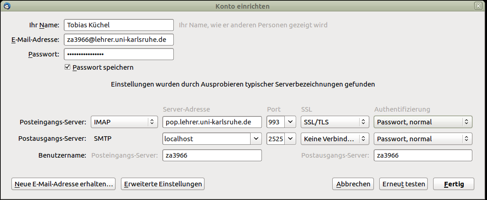

==================================
 Empfange E-Mails mit Thunderbird
==================================

Sie möchten Ihre E-Mails mit Hilfe eines zu Hause/an der Schule
installierten E-Mailprogramms empfangen. Das geht.  Senden geht
zunächst nicht.

Am Beispiel von `Mozilla Thunderbird
<https://www.mozilla.org/de/thunderbird/>`_ wird nachstehend gezeigt,
wie Sie das Programm konfigurieren müssen. Laden Sie das Programm
herunter und installieren Sie es.

Falls beim ersten Starten das Dialogfenster "Willkommen" erscheint,
wählen Sie "Überspringen und meine existierende E-Mail-Adresse
verwenden".

.. figure:: media/thunderbird-firststart.png

Ansonsten wählen Sie im Menü unter *Datei* -> *Neu* bzw. unter *Neue
Nachricht* unter dem Untermenü -> *Existierendes E-Mail-Konto...*

.. figure:: media/thunderbird-newaccount.png

Anschließend wird ein neues Konto eingerichtet, dabei geben Sie Name,
E-Mail-Adresse und Passwort ein. Ersetzen Sie dabei ``za3966`` durch
Ihr eigenes Benutzerkonto. Wenn Sie das Passwort speichern, sollten
Sie als Sicherheitsmaßnahme wenigstens in Thunderbird ein
Master-Passwort vergeben.

.. figure:: media/thunderbird-newaccount-1.png

Nachdem Thunderbird einige Server-Einstellungen vergeblich versucht
automatisch vorzunehmen, geben Sie bitte folgende Daten von Hand ein:

Statt "IMAP" können Sie als Posteingangsserver auch POP3 wählen. Dann
wird der Port automatisch auf ``995`` umgestellt.
