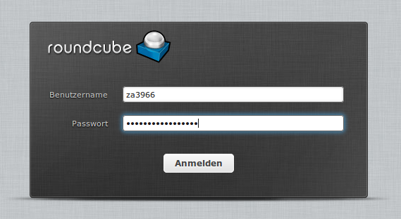
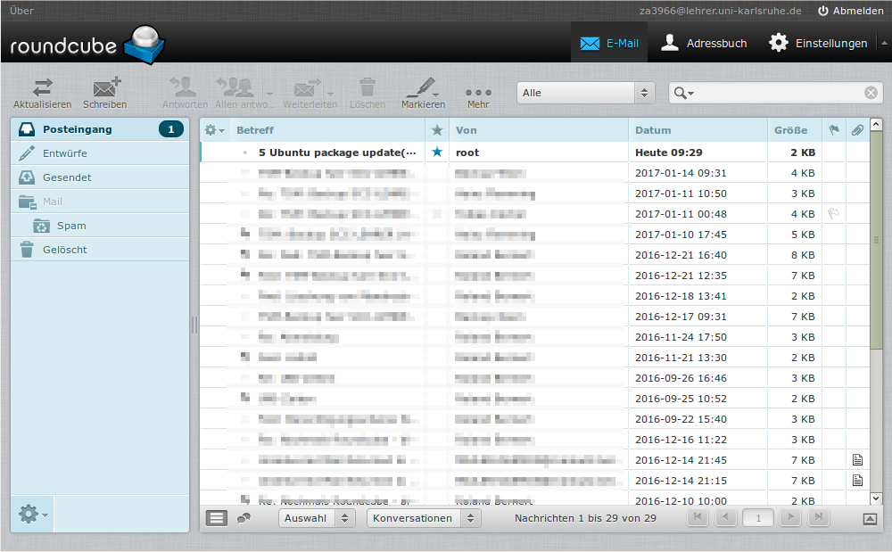
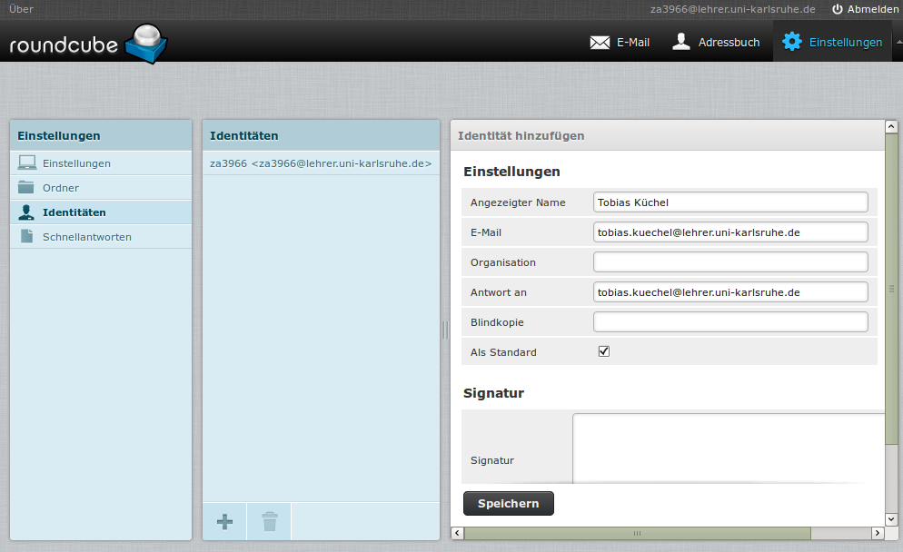
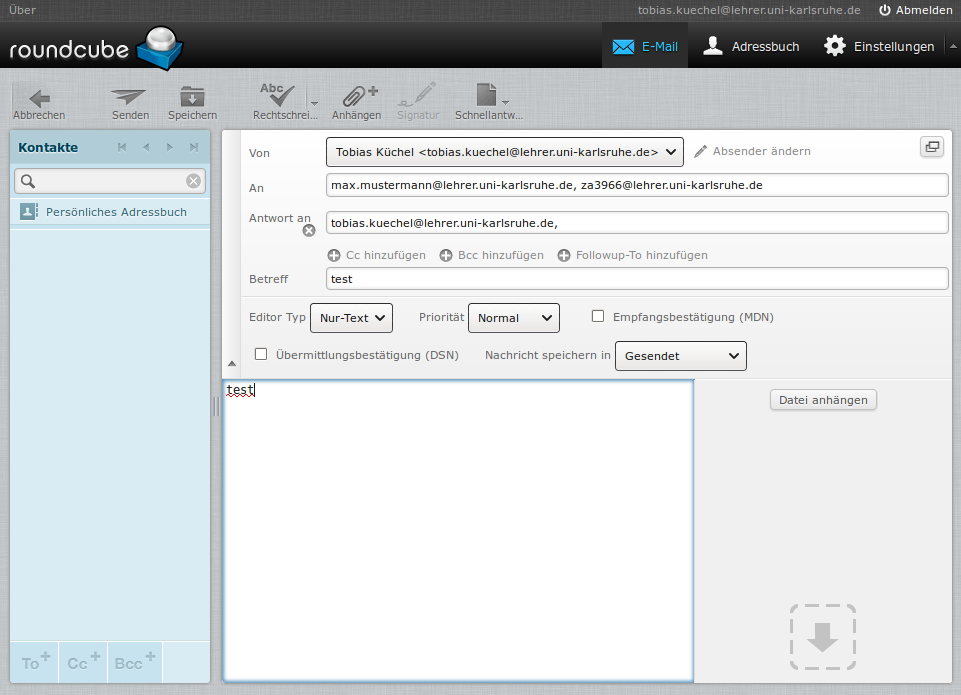

=========================
 E-Mail über den Browser
=========================

Das E-Mail-Konto lässt sich am einfachsten über den Browser nutzen:

https://webmail.lehrer.uni-karlsruhe.de

Ändern Sie vor der ersten Nutzung bitte Ihr Passwort: :ref:`label-passwort-aendern`.

Melden Sie sich im Browser mit Ihrem Benutzernamen und Ihrem Passwort an:

Standardmäßig sehen Sie Ihren Posteingang.

Die Bedienung eines Webmailers sollte intuitiv sein und wird hier
weiter nicht beschrieben. 

.. note::

   **Standardeinstellungen für neue Benutzer**

   - Der Papierkorb wird standardmäßig beim Abmelden geleert.

Vorname.Nachname E-Mail-Adresse
===============================

Es bietet sich an, zusätzlich zu Ihrer kryptischen E-Mail-Adresse
``zaxxx@lehrer.uni-karlsruhe.de`` die Alias-E-Mail-Adresse zu
verwenden. Öffnen Sie *Einstellungen* -> *Identitäten* und erstellen
Sie mit Hilfe des "+"-Knopfes eine neue Identität, die als
``Vorname.Nachname@lehrer.uni-karlsruhe.de`` angelegt wurde.

Wenn Sie dies abgespeichert haben, wird beim Erstellen einer neuen
Nachricht, die Absender- sowie "Antwort-an"-Adresse mit dieser
E-Mail-Adresse eingestellt. Natürlich können Sie auch an das
Benutzerkonto eines Benutzers senden indem Sie dessen E-Mail-Adresse
``zaXXXX@lehrer.uni-karslruhe.de`` verwenden.

Sobald Sie ein Adressbuch anlegen und befüllen (oder Daten
importieren), können Sie auch im Feld des Empfängers mit einigen
Anfangsbuchstaben Vorschläge auswählen.
